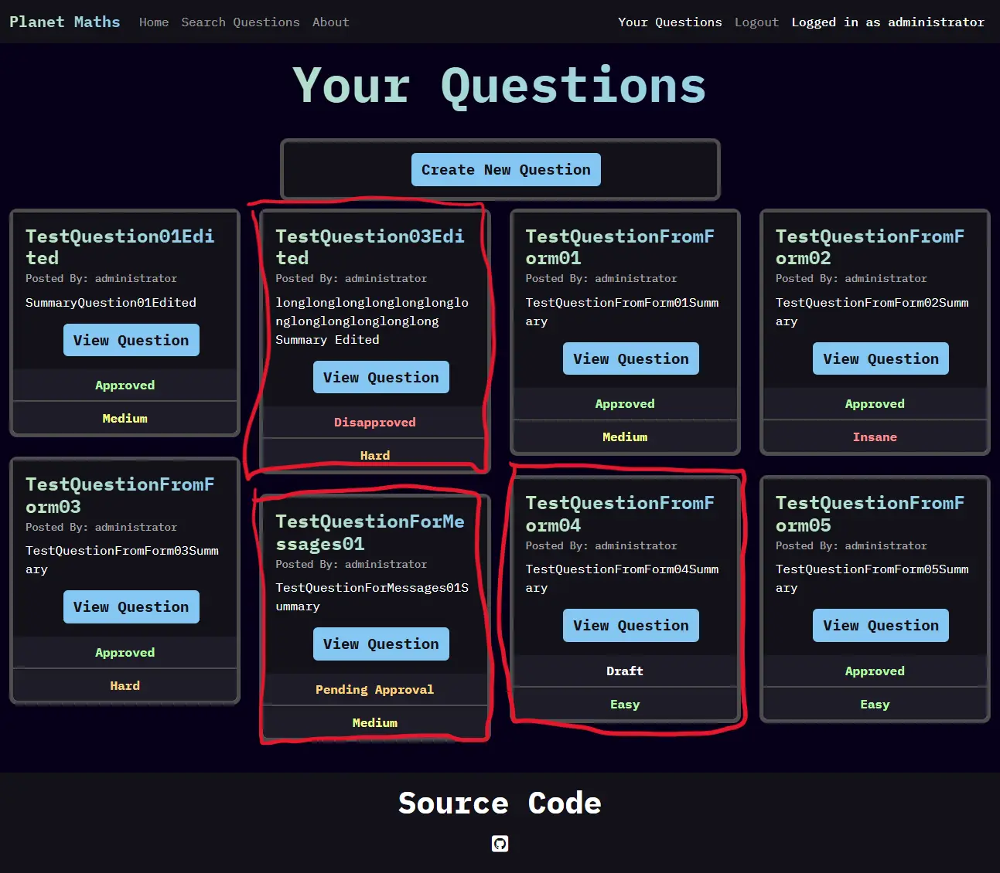
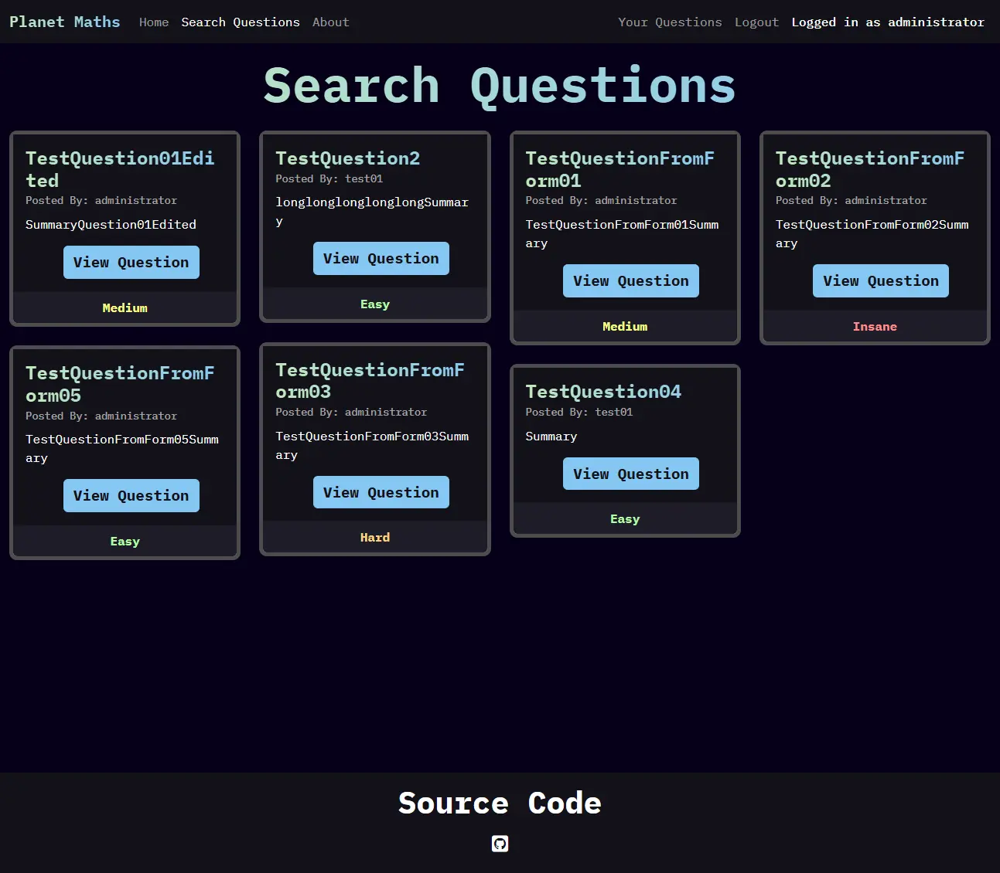
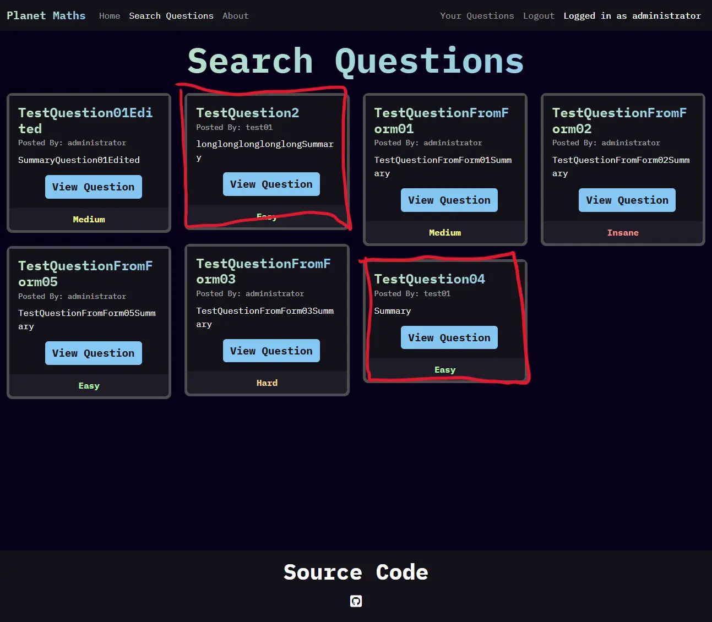

#  Planet Maths

<a href="https://capstone-maths-123849071230498-7f887ae33317.herokuapp.com/" target="_blank">| Live Project |</a>

## Introduction

Planet Maths is my final project developed for the Code Institute Full Stack Web Development course. It was designed following a simple set of guidelines - use a [Django](https://docs.djangoproject.com/en/5.2/releases/4.2.23/) backend to create a website that allows for user CRUD (create, read, update, delete) functionality.

## Project Outline

Planet Maths was developed with the goal of allowing anyone to submit maths questions, for anyone to use for any reason - perhaps studying for exams, for smaller brain teasers, or otherwise. As a result, it should be accessible for all ages.

## Table of Contents

* [Planet Maths](#planet-maths)
    - [Introduction](#introduction)
    - [Project Outline](#project-outline)
* [UX Design](#ux-design)
    - [User Stories](#user-stories)
        - [A Note on Agile](#a-note-on-agile)
        - [Must Have](#must-have)
        - [Should Have](#should-have)
        - [Could Have](#could-have)
        - [Won't Have](#wont-have)
    - [Theming](#theming)
        - [Colours Used](#colours-used)
            - [Main Colours](#main-colours)
            - [Misc Colours](#misc-colours)
    - [Font](#font)
    - [Wireframes](#wireframes)
* [Features](#features)
    - [General Features](#general-features)
        - [Navbar](#navbar)
        - [Home Page](#home-page)
        - [About Page](#about-page)
        - [Search Questions Page](#search-questions-page)
        - [Your Questions Page](#your-questions-page)
        - [Sign Up, Sign In, Logout Pages](#sign-up-sign-in-logout-pages)
    - [Responsive Design](#responsive-design)
        - [Navbar Collapse and Expand](#navbar-collapse-and-expand)
        - [Question Cards](#question-cards)
    - [Accessibility](#accessibility)
* [Deployment and Tools](#deployment-and-tools)
    - [Deployment](#deployment)
    - [Tools](#tools)
        - [Applications and Tools Used](#applications-and-tools-used)
        - [Languages](#languages)
        - [Libraries and Frameworks](#libraries-and-frameworks)
* [Testing and Validation](#testing-and-validation)
    - [Testing](#testing)
        - [Automatic Tests](#automatic-tests)
        - [Manual Tests](#manual-tests)
            - [Only Approved Questions Appear on Search Questions Page](#only-approved-questions-appear-on-search-questions-page)
            - [Only Owned Questions Appear on Your Questions Page](#only-owned-questions-appear-on-your-questions-page)
            - [Can Only Edit and Delete Owned Questions](#can-only-edit-and-delete-owned-questions)
            - [General Features Testing](#general-features-testing)
        - [Best Practices and Optimisation](#best-practices-and-optimisation)
            - [Home Page Lighthouse](#home-page-lighthouse)
            - [About Page Lighthouse](#about-page-lighthouse)
            - [Search Questions Page Lighthouse](#search-questions-page-lighthouse)
            - [Your Questions Page Lighthouse](#your-questions-page-lighthouse)
            - [Sign In Page Lighthouse](#sign-in-page-lighthouse)
            - [Sign Out Page Lighthouse](#sign-out-page-lighthouse)
            - [Sign Up Page Lighthouse](#sign-up-page-lighthouse)     
    - [Validation](#validation)
        - [HTML](#html)
            - [Home Page HTML](#home-page-html)
            - [About Page HTML](#about-page-html)
            - [Search Questions Page HTML](#search-questions-page-html)
            - [Your Questions Page HTML](#your-questions-page-html)
            - [Sign In Page HTML](#sign-in-page-html)
            - [Sign Out Page HTML](#sign-out-page-html)
            - [Sign Up Page HTML](#sign-up-page-html)
        - [CSS](#css)
        - [Javascript](#javascript)
        - [Python](#python)
* [AI Usage and Implementation](#ai-usage-and-implementation)
    - [AI Code Generation](#ai-code-generation)
    - [AI Debugging](#ai-debugging)
    - [AI Testing](#ai-testing)
    - [AI Optimisation](#ai-optimisation)
    - [Reflection on AI Usage](#reflection-on-ai-usage)
* [References and Credits](#references-and-credits)

# UX Design

## User Stories

### A Note on Agile

For brevity, only the main text of each user story will be listed here. For full user stories (along with addition features not yet implemented), please visit the [project board](https://github.com/users/hpjohnson/projects/3). As of the creation of this readme, only the must haves are implemented.

### Must Have

* As a user I want to view a page of questions so that I can practice my maths skills.
* As a user / the site admin I want to be able to submit new questions to the website to help others learn.
* As a user I can register an account so that I may use more of the websites features.
* As the site admin I want an about page so that I may detail the site's goals and functionality.
* As a user I can edit my submitted questions so that I can fix mistakes, or make other improvements.
* As a user I can delete my uploaded questions.
* As the site admin I want the website to have attractive css styling, intuitive interactivity via javascript, and to follow modern accessibility and UX standards.

### Should Have

* As the site admin I want the about page to contain a development logging feature so that I may detail updates for the users.

### Could Have

* As a user I can manage my comments on questions for corrections/feedback.
* As a site user I want to be able to search questions by tags for easier question finding.
* As the site admin I want a feature that allows users to generate symbolic maths questions for practice.

### Won't Have

* As user I want to be able to select a variety of questions to create a question set, that I can download for offline usage.

## Theming

As this website aims to be able to collect questions from anyone worldwide, it seemed appropriate to use the word planet in the website's name. Colours were chosen to fit this goal - dark backgrounds for the blackness of space, and green + blue for main highlights representing the main colours of Earth.

All colours pass contrast checkers for accessibility - I used [WAVE](https://chromewebstore.google.com/detail/wave-evaluation-tool/jbbplnpkjmmeebjpijfedlgcdilocofh) and [Colour Contrast Checker](https://colourcontrast.cc/).

### Colours Used

Colour names provided by [Colour Namer](https://colornamer.robertcooper.me/), using the "Wikipedia Colour Names" colour list.

Main colours make up the majority of colours on the website. The misc colours are for smaller highlights - for example, the colours of the difficulty indicators.

#### Main Colours

- Smoky Black `#060018`
- Baby Blue `#85c7f2`
- Tea Green `#c3e8bd`
- Eerie Black `#131219`
- Raisin Black `#1e1c27`
- Davy's Grey `#4d4d4d`
- White `#ffffff`

#### Misc Colours

- Quick Silver `#a3a3a3`
- Granny Smith Apple `#b1fca2`
- Key Lime `#f7ff86`
- Jasmine `#fcd47f`
- Mona Lisa `#ff8d8d`
- Red Salsa `#ff3e3e`

## Font

I wanted a simple blocky, high-tech looking font to complete the look of my website. I chose [IBM Plex Mono](https://fonts.google.com/specimen/IBM+Plex+Mono), sourced from [Google Fonts](https://fonts.google.com/).

For a consistent look, I chose to use only a single font for the entirety of the website. Important text like titles are made to stand out via usage of a gradient effect, and/or by increasing the font weight for a bold look. 

## Wireframes

Wireframes were created using [Balsamiq](https://balsamiq.com/).

<a href="docs/misc/wireframes.webp" target="_blank">Click to view wireframes.</a>

# Features

## General Features

### Navbar

A responsive [Bootstrap](https://getbootstrap.com/docs/5.3/getting-started/download/) navbar is used for site navigation. On smaller screen sizes, the text gets moved to a dropdown menu.

### Home Page

The home page serves as a brief introduction to the website, along with links to the Search Questions page, and the About Page for further information.

### About Page

The about page serves as a more indepth look at the website, and its current avaliable features.

### Search Questions Page

The search questions page contains a list of all questions that have been approved for viewing. Each one is a simple [Bootstrap](https://getbootstrap.com/docs/5.3/getting-started/download/) card which contains pertinant information, and a view button which opens a modal for full information. See the [Responsive Design](#responsive-design) section for more detail on how they have been made responsive.

### Your Questions Page

The your questions page allows for a user to submit new questions, and view any questions they have submitted. They may also update, and delete any questions they have uploaded. This functionality is implemented using [Bootstrap](https://getbootstrap.com/docs/5.3/getting-started/download/) modals, with a variety of buttons to open the correct modals and to automatically fill in information as required. The question cards are layed out using identical functionality as the search questions page.

### Sign Up, Sign In, Logout Pages

These pages allow for the user to perform account related features specified by the title of the page. 

## Responsive Design

Media queries and appropriate [Bootstrap](https://getbootstrap.com/docs/5.3/getting-started/download/) classes are used to ensure the website looks nice across all screen sizes. Media queries are used to align the heights of cards where appropriate, and change text size to prevent newlines in the navbar in cases where the user is logged in with a long username on certain screen sizes. 

### Navbar Collapse and Expand

The navbar collapses on smaller screen sizes.

### Question Cards

Question cards either take up the full width, a half width, a third width, or a quarter width of the screen dependant on screen size. This was achieved using [Bootstrap](https://getbootstrap.com/docs/5.3/getting-started/download/) columns. The questions are dynamically placed based on heights using the [Masonry](https://masonry.desandro.com/) plugin.

<a href="docs/responsive/masonrySM.webp" target="_blank">Small Screens</a>

<a href="docs/responsive/masonryMD.webp" target="_blank">Medium Screens</a>

<a href="docs/responsive/masonryLG.webp" target="_blank">Large Screens</a>

<a href="docs/responsive/masonryXL.webp" target="_blank">Extra Large Screens</a>

## Accessibility

Best accessibility practices were evaluated using [WAVE](https://chromewebstore.google.com/detail/wave-evaluation-tool/jbbplnpkjmmeebjpijfedlgcdilocofh). The results for each page that a general user is expected to use are shown below (ie the admin panel was not checked, as it cannot be used by anyone other than myself).

# Deployment and Tools

## Deployment

The project is deployed using Heroku. The general steps taken are as follows - 

1. Configuration
    1. Create and link project to database
    2. Obscure environment variables into a seperate file
    3. Add environment variables to Heroku 
    4. Configure Procfile to allow Heroku to use an appropriate server
    5. Create requirements.txt so correct python modules may be imported
    6. Ensure debug is only enabled when local hosting
2. Deployment
    1. Push changes to Github
    2. Deploy from Heroku

## Tools

### Applications and Tools Used

- [VSCode](https://code.visualstudio.com/) IDE.
- [WAVE](https://chromewebstore.google.com/detail/wave-evaluation-tool/jbbplnpkjmmeebjpijfedlgcdilocofh) for accessibility testing.
- [Google Lighthouse](https://developer.chrome.com/docs/lighthouse) for best practices.
- [Google Fonts](https://fonts.google.com/) for fonts.
- [Colour Contrast Checker](https://colourcontrast.cc/) for colour contrast checking.
- [Squoosh](https://squoosh.app/) for image compression for this readme.
- [Shields.io](https://shields.io/) for language badges.
- [JSHint](https://jshint.com/) for javascript checking.
- [W3C Markup Validation Service](https://validator.w3.org/) for HTML validation.
- [W3C CSS Validation Service](https://jigsaw.w3.org/css-validator/#validate_by_uri) for CSS validation

### Languages

### Libraries and Frameworks

- The python libraries used for this project can be viewed in the requirements.txt file.
- [Bootstrap](https://getbootstrap.com/docs/5.3/getting-started/download/)
- [Masonry](https://masonry.desandro.com/)

# Testing and Validation

## Testing

### Automatic Tests

Automated testing was used to forcefully enter invalid data into forms. The testing file for this can be seen in `manageQuestions/test_forms.py`. I only need to test one of the forms with this method (I chose the create form) as the forms are identical, save for a couple of HTML classes and ids. The outcome from the testing I am looking for is 9/9 failed tests, which is what occurs.

### Manual Tests

#### Only Approved Questions Appear on Search Questions Page

This functions correctly, as determined by looking at the page and the admin panel and manually checking values. This can also be seen in the screenshots below - the questions circled in red on the your questions page correctly do not appear on the search questions page.

#### Only Owned Questions Appear on Your Questions Page

This functions correctly, as determined by checking the admin panel and pages manually. It can also be seen in the below screenshots, questions posted by a different user circled in red do not appear on the your questions page.

#### Can Only Edit and Delete Owned Questions

While only the questions you actually own can appear on your own page, it is possible to change the questionID manually in the HTML to attempt to delete another persons question. Ideally to prevent this, I would encrypt this id before serving the questions to the user and decrypt once the server recieves the id back, but the method of checking the id and returning a message works correctly for now. I checked this by editing the HTML manually. The corresponding error messages in the screenshots below are "An unexpected error occured" for deletion, and "Form not valid" for editing.

#### General Features Testing

All other pages work correctly when attempting to view them, and for their general function. Any questions titled "TestQuestionFromForm" were created using the form on the page and were successfully added to the website, and any that have the word "Edited" in the title were edited from the form on page.

### Best Practices and Optimisation

Best practices and optimisation were evaluated using [Google Lighthouse](https://developer.chrome.com/docs/lighthouse). All pages of the website score perfect marks for both of these categories.

#### Home Page Lighthouse

#### About Page Lighthouse

#### Search Questions Page Lighthouse

#### Your Questions Page Lighthouse

#### Sign In Page Lighthouse

#### Sign Out Page Lighthouse

#### Sign Up Page Lighthouse

## Validation

### HTML

HTML was validated using the [W3C Markup Validation Service](https://validator.w3.org/). All pages pass with only ignorable warnings, with a notable exception being the sign up page. The issue with this page is on django's end and not with anything I've coded myself - the default signup form simply has incorrect HTML. For the future, I would design my own login forms to improve the styling and fix this error. However for now, I will simply leave it as is and note the issue down here.

#### Home Page HTML

#### About Page HTML

#### Search Questions Page HTML

#### Your Questions Page HTML

#### Sign In Page HTML

#### Sign Out Page HTML

#### Sign Up Page HTML

As noted above, this page does not pass the validation through no fault of my own.

### CSS

CSS was validated using the [W3C CSS Validation Service](https://jigsaw.w3.org/css-validator/#validate_by_uri).

### Javascript

Javascript was validated using [JSHint](https://jshint.com/). There are some unused variables that I elected to leave in as they will be of use for potential further updates to the website.

### Python

All python code written follows the PEP8 standard. Compliance was assured using an extension from within VSCode. All files pass, with the exception of the settings.py file inside the config folder. This fail is unavoidable, due to the length of some of django's module names forcing lines to be over the character limit imposed by PEP8. Screenshots will not be provided for this, as there are far too many pages to include in this document.

# AI Usage and Implementation

As requested by Code Institute, I have to include a statement on how AI was used in this project. 

AI was not used in this project for the reasons stated below.

## AI Code Generation

This website is simple, and was created with the purpose to learn how to create a website from scratch. For these reasons, I chose to forgo using AI for code generation purposes. In addition, I code because I enjoy the puzzle solving aspect - using AI would then deprive all the enjoyment I get out of coding.

## AI Debugging

Bugs were fixed manually while coding. Any issues I came across could be easily addressed using the error messages provided, and logic errors were simple to fix upon re-read of code. It would have been slower to rely on AI for this purpose.

## AI Testing

Due to unforseen circumstances, I was unable to complete the coursework on automatic testing before starting work on this project. I decided it would be appropriate to then use my own project as the basis for completing this part of the course, rather than the provided demo project. In addition, manual testing was done throughout development to ensure features worked as I implemented them. As a result, AI was not necessary for this purpose.

## AI Optimisation

Google lighthouse gives the website a perfect 100 across the board for optimisation. Therefore AI was of no use for optimisation.

## Reflection on AI Usage

AI was of no use for this project. Due to the simplicity of the website, it would have been far slower to generate code, manually ensure it looks correct, and test it than just writing it myself. My workflow of testing features as soon as they are implemented made AI not needed for testing, optimisation, or debugging. In addition, I enjoy making things myself - asking a machine to do it for me would deprive me of the joy of a hobby, and actively disrupt any form of knowledge/understanding I would hope to gain from completing a course such as this one.

# References and Credits

Here is a master list of all resouces, programs, etc used throughout the project.

- Project brief and learning materials by [Code Institute](https://codeinstitute.net/).
- References and base component code from [Bootstrap 5.3 Documentation](https://getbootstrap.com/docs/5.3/getting-started/introduction/).
- [Django Documentation](https://docs.djangoproject.com/en/4.2/).
- Accessibility checked using [WAVE](https://chromewebstore.google.com/detail/wave-evaluation-tool/jbbplnpkjmmeebjpijfedlgcdilocofh).
- Optimisation and best practices checked using [Google Lighthouse](https://developer.chrome.com/docs/lighthouse).
- README badges by [Shields.io](https://shields.io/badges/static-badge) and [Simple Icons](https://simpleicons.org/).
- README image compression done using [Squoosh](https://squoosh.app/).
- Project coded using [VSCode](https://code.visualstudio.com/).
- Favicon generated by [favicon.io](https://favicon.io/).