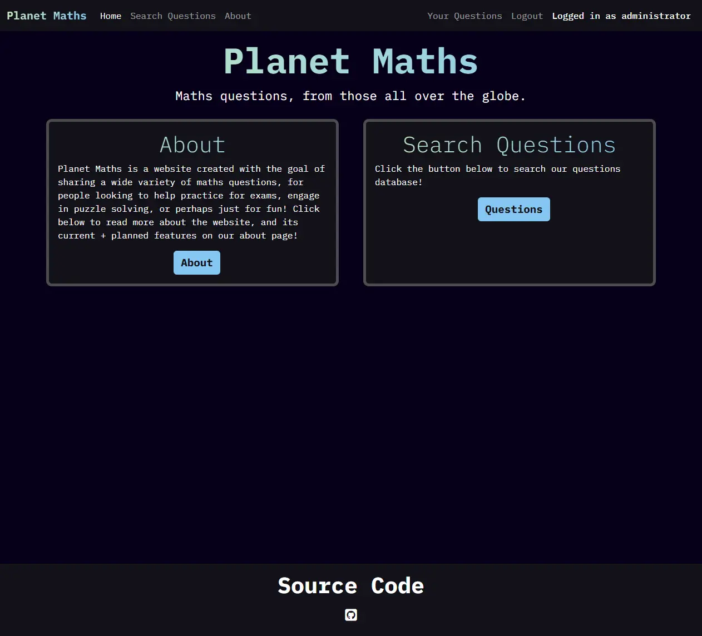
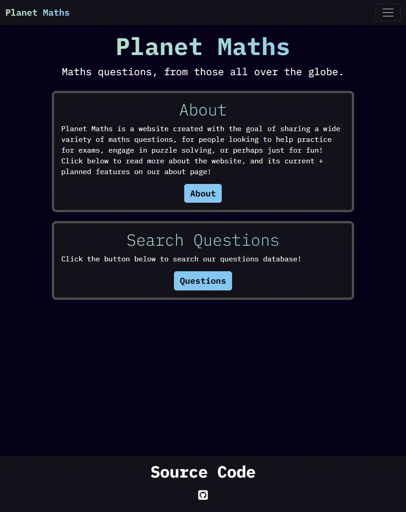

#  Planet Maths

<a href="https://capstone-maths-123849071230498-7f887ae33317.herokuapp.com/" target="_blank">| Live Project |</a>

## Introduction

Planet Maths is my final project developed for the Code Institute Full Stack Web Development course. It was designed following a simple set of guidelines - use a Django backend to create a website that allows for user CRUD (create, read, update, delete) functionality.

## Project Outline

Planet Maths was developed with the goal of allowing anyone to submit maths questions, for anyone to use for any reason - perhaps studying for exams, for smaller brain teasers, or otherwise. As a result, it should be accessible for all ages.

## Table of Contents

* [Planet Maths](#planet-maths)
    - [Introduction](#introduction)
    - [Project Outline](#project-outline)
* [UX Design](#ux-design)
    - [User Stories](#user-stories)
        - [A Note on Agile](#a-note-on-agile)
        - [Must Have](#must-have)
        - [Should Have](#should-have)
        - [Could Have](#could-have)
        - [Won't Have](#wont-have)
    - [Theming](#theming)
        - [Colours Used](#colours-used)
            - [Main Colours](#main-colours)
            - [Misc Colours](#misc-colours)
    - [Font](#font)
    - [Wireframes](#wireframes)
* [Features](#features)
    - [General Features](#general-features)
        - [Navbar](#navbar)
        - [Home Page](#home-page)
        - [About Page](#about-page)
        - [Search Questions Page](#search-questions-page)
        - [Your Questions Page](#your-questions-page)
        - [Sign Up, Sign In, Logout Pages](#sign-up-sign-in-logout-pages)
    - [Responsive Design](#responsive-design)
        - [Navbar Collapse and Expand](#navbar-collapse-and-expand)
        - [Question Cards](#question-cards)
    - [Accessibility](#accessibility)
* [Deployment and Tools](#deployment-and-tools)
    - [Deployment](#deployment)
    - [Tools](#tools)
        - [Applications and Tools Used](#applications-and-tools-used)
        - [Languages](#languages)
        - [Libraries and Frameworks](#libraries-and-frameworks)

# UX Design

## User Stories

### A Note on Agile

For brevity, only the main text of each user story will be listed here. For full user stories (along with addition features not yet implemented), please visit the [project board](https://github.com/users/hpjohnson/projects/3). As of the creation of this readme, only the must haves are implemented.

### Must Have

* As a user I want to view a page of questions so that I can practice my maths skills.
* As a user / the site admin I want to be able to submit new questions to the website to help others learn.
* As a user I can register an account so that I may use more of the websites features.
* As the site admin I want an about page so that I may detail the site's goals and functionality.
* As a user I can edit my submitted questions so that I can fix mistakes, or make other improvements.
* As a user I can delete my uploaded questions.
* As the site admin I want the website to have attractive css styling, intuitive interactivity via javascript, and to follow modern accessibility and UX standards.

### Should Have

* As the site admin I want the about page to contain a development logging feature so that I may detail updates for the users.

### Could Have

* As a user I can manage my comments on questions for corrections/feedback.
* As a site user I want to be able to search questions by tags for easier question finding.
* As the site admin I want a feature that allows users to generate symbolic maths questions for practice.

### Won't Have

* As user I want to be able to select a variety of questions to create a question set, that I can download for offline usage.

## Theming

As this website aims to be able to collect questions from anyone worldwide, it seemed appropriate to use the word planet in the website's name. Colours were chosen to fit this goal - dark backgrounds for the blackness of space, and green + blue for main highlights representing the main colours of Earth.

All colours pass contrast checkers for accessibility - I used [WAVE](https://chromewebstore.google.com/detail/wave-evaluation-tool/jbbplnpkjmmeebjpijfedlgcdilocofh) and [Colour Contrast Checker](https://colourcontrast.cc/).

### Colours Used

Colour names provided by [Colour Namer](https://colornamer.robertcooper.me/), using the "Wikipedia Colour Names" colour list.

Main colours make up the majority of colours on the website. The misc colours are for smaller highlights - for example, the colours of the difficulty indicators.

#### Main Colours

- Smoky Black `#060018`
- Baby Blue `#85c7f2`
- Tea Green `#c3e8bd`
- Eerie Black `#131219`
- Raisin Black `#1e1c27`
- Davy's Grey `#4d4d4d`
- White `#ffffff`

#### Misc Colours

- Quick Silver `#a3a3a3`
- Granny Smith Apple `#b1fca2`
- Key Lime `#f7ff86`
- Jasmine `#fcd47f`
- Mona Lisa `#ff8d8d`
- Red Salsa `#ff3e3e`

## Font

I wanted a simple blocky, high-tech looking font to complete the look of my website. I chose [IBM Plex Mono](https://fonts.google.com/specimen/IBM+Plex+Mono), sourced from [Google Fonts](https://fonts.google.com/).

For a consistent look, I chose to use only a single font for the entirety of the website. Important text like titles are made to stand out via usage of a gradient effect, and/or by increasing the font weight for a bold look. 

## Wireframes

Wireframes were created using [Balsamiq](https://balsamiq.com/).

<a href="docs/misc/wireframes.webp" target="_blank">Click to view wireframes.</a>

# Features

## General Features

### Navbar

A responsive [Bootstrap](https://getbootstrap.com/docs/5.3/getting-started/download/) navbar is used for site navigation. On smaller screen sizes, the text gets moved to a dropdown menu.

### Home Page

The home page serves as a brief introduction to the website, along with links to the Search Questions page, and the About Page for further information.

### About Page

The about page serves as a more indepth look at the website, and its current avaliable features.

### Search Questions Page

The search questions page contains a list of all questions that have been approved for viewing. Each one is a simple [Bootstrap](https://getbootstrap.com/docs/5.3/getting-started/download/) card which contains pertinant information, and a view button which opens a modal for full information. See the [Responsive Design](#responsive-design) section for more detail on how they have been made responsive.

### Your Questions Page

The your questions page allows for a user to submit new questions, and view any questions they have submitted. They may also update, and delete any questions they have uploaded. This functionality is implemented using [Bootstrap](https://getbootstrap.com/docs/5.3/getting-started/download/) modals, with a variety of buttons to open the correct modals and to automatically fill in information as required. The question cards are layed out using identical functionality as the search questions page.

### Sign Up, Sign In, Logout Pages

These pages allow for the user to perform account related features specified by the title of the page. 

## Responsive Design

Media queries and appropriate [Bootstrap](https://getbootstrap.com/docs/5.3/getting-started/download/) classes are used to ensure the website looks nice across all screen sizes. Media queries are used to align the heights of cards where appropriate, and change text size to prevent newlines in the navbar in cases where the user is logged in with a long username on certain screen sizes. 

### Navbar Collapse and Expand

The navbar collapses on smaller screen sizes.

### Question Cards

Question cards either take up the full width, a half width, a third width, or a quarter width of the screen dependant on screen size. This was achieved using [Bootstrap](https://getbootstrap.com/docs/5.3/getting-started/download/) columns. The questions are dynamically placed based on heights using the [Masonry](https://masonry.desandro.com/) plugin.

<a href="docs/responsive/masonrySM.webp" target="_blank">Small Screens</a>

<a href="docs/responsive/masonryMD.webp" target="_blank">Medium Screens</a>

<a href="docs/responsive/masonryLG.webp" target="_blank">Large Screens</a>

<a href="docs/responsive/masonryXL.webp" target="_blank">Extra Large Screens</a>

## Accessibility

Best accessibility practices were evaluated using [WAVE](https://chromewebstore.google.com/detail/wave-evaluation-tool/jbbplnpkjmmeebjpijfedlgcdilocofh). The results for each page that a general user is expected to use are shown below (ie the admin panel was not checked, as it cannot be used by anyone other than myself).

# Deployment and Tools

## Deployment

The project is deployed using Heroku. The general steps taken are as follows - 

1. Configuration
    1. Create and link project to database
    2. Obscure environment variables into a seperate file
    3. Add environment variables to Heroku 
    4. Configure Procfile to allow Heroku to use an appropriate server
    5. Create requirements.txt so correct python modules may be imported
    6. Ensure debug is only enabled when local hosting
2. Deployment
    1. Push changes to Github
    2. Deploy from Heroku

## Tools

### Applications and Tools Used

- [VSCode](https://code.visualstudio.com/) IDE.
- [WAVE](https://chromewebstore.google.com/detail/wave-evaluation-tool/jbbplnpkjmmeebjpijfedlgcdilocofh) for accessibility testing.
- [Google Lighthouse](https://developer.chrome.com/docs/lighthouse) for best practices.
- [Google Fonts](https://fonts.google.com/) for fonts.
- [Colour Contrast Checker](https://colourcontrast.cc/) for colour contrast checking.
- [Squoosh](https://squoosh.app/) for image compression for this readme.
- [Shields.io](https://shields.io/) for language badges.

### Languages

### Libraries and Frameworks

- The python libraries used for this project can be viewed in the requirements.txt file.
- [Bootstrap](https://getbootstrap.com/docs/5.3/getting-started/download/)
- [Masonry](https://masonry.desandro.com/)

# Testing and Validation

## Index

# AI Usage and Implementation

As requested by Code Institute, I have to include a statement on how AI was used in this project. 

AI was not used in this project for the reasons stated below.

## AI Code Generation

## AI Debugging

## AI Optimisation

## Reflection on AI Usage

# References and Credits
